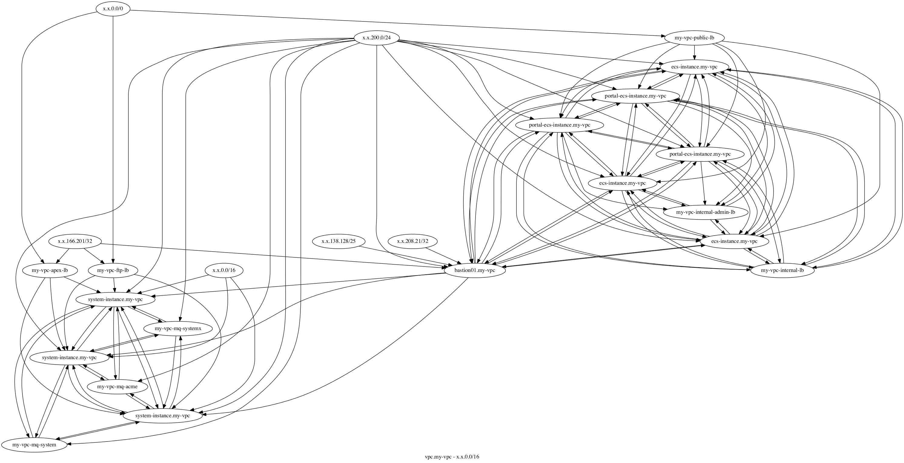
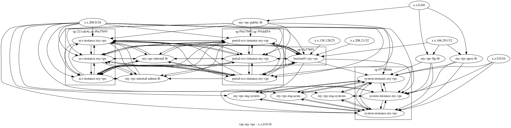
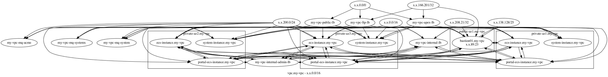

aws-dot
==============
A visualizer of the network of security group dependencies in an AWS VPC.

It can generate the following:
- An HTML table with all security group dependencies between network components.
- A graph of all security group dependencies between network components.
- A graph of all security group dependencies between network components grouped by security groups.
- A graph of all security group dependencies between network components grouped by subnet.


html table
----------
An HTML table with all security group dependencies between network components.
.

overall graph
--------------
A graph of all security group dependencies between network components.
 

Grouped by security group
--------------------------
A graph of all security group dependencies between network components grouped by security groups.
 

Grouped by subnets
------------------
A graph of all security group dependencies between network components grouped by subnet.
 


usage
=====
```
aws-dot [-h] [--directory DIRECTORY] [--use-subnets]
                       [--use-security-group-subgraphs]
                       [--exclude-security-group SECURITY-GROUP]
                       [--profile PROFILE] [--region REGION]
                       [--assume-role ROLE]
```


optional arguments:
```
  -h, --help            show this help message and exit
  --directory DIRECTORY, -d DIRECTORY
                        output directory defaults to .
  --use-subnets, -n     use subnet subgraphs
  --use-security-group-subgraphs, -s
                        use security group subgraphs
  --exclude-security-group SECURITY-GROUP, -x SECURITY-GROUP
                        exclude security group
  --profile PROFILE, -p PROFILE
                        select the AWS profile to use
  --region REGION, -r REGION
                        select region to graph
  --assume-role ROLE, -a ROLE
                        ARN of the role to assume
```


Install
-------
- brew install graphviz
- pip install aws-visualizer

Example
-------

```
$ aws-dot --directory .
$ for F in *.dot; do dot -Tpng -o $(basename $F .dot).png $F; done
$ open *.html *.png
```

Quickstart
-----------
./run.sh will generate three different views for each subnet in target: default, securitygroups and subnet.

